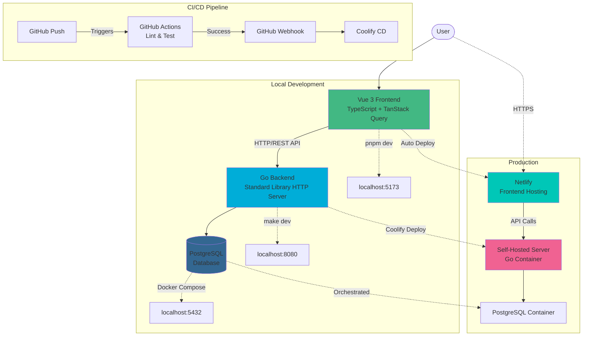

# Goalify

**RPG-Driven Productivity Tracker**

Build your character, unlock time-era narratives, and progress through history as you complete real-world goals.

---

## Overview

Goalify transforms productivity tracking into an RPG experience where completing tasks grants XP, levels unlock historical narratives (WW1 soldier in 1914, and beyond), and consistent progress builds both your character and your real-world achievements. This is a full-stack TypeScript and Go application designed with simplicity and developer productivity in mind.

## Problem Statement

Traditional todo apps lack meaningful engagement and fail to provide lasting motivation. Checking off a box feels hollow. Gamification attempts often feel superficial or divorced from actual progress. Users need a system that makes productivity inherently rewarding while maintaining the simplicity required for daily use.

## Solution

Goalify bridges productivity and engagement through:

- **Goal tracking with purpose**: Create goals across custom categories, mark tasks complete, and watch measurable progress
- **XP and leveling system**: Every completed goal grants experience points that contribute to level progression
- **Time-era narratives**: Unlock historical RPG storylines (starting with 1914 WW1) as you reach new level thresholds
- **Character progression**: Build and develop your character alongside your real-world productivity gains
- **Simplicity first**: Clean, minimal interface with straightforward workflows - no unnecessary complexity

## Technical Architecture



### Architecture Highlights

- **Frontend**: Vue 3 with Composition API and TypeScript, deployed to Netlify for fast global delivery
- **Backend**: Go 1.25 standard library HTTP server, emphasizing simplicity over framework overhead
- **Database**: PostgreSQL with Goose migrations, containerized and orchestrated via Coolify
- **Infrastructure**: Self-hosted on personal server using Coolify for container orchestration (Go backend + PostgreSQL)
- **CI/CD**: GitHub Actions runs linting and tests on every push; GitHub webhooks trigger Coolify for automated deployments

## Key Technical Decisions

**Simplicity over complexity**: Throughout this project, architectural decisions favor ease of development and maintainability over premature optimization or unnecessary abstractions.

- **Go standard library over frameworks**: The backend uses Go's `net/http` package directly rather than heavyweight frameworks. This keeps the codebase minimal, reduces dependency overhead, and leverages Go's excellent standard library.

- **Feature-based frontend architecture**: Instead of separating by technical role (components/, services/, etc.), the frontend organizes code by domain features (goals/, levels/, auth/). Each feature contains its own queries, schemas, components, and forms, making it easy to locate and modify related code.

- **TanStack Query for data management**: Rather than maintaining manual state synchronization, TanStack Query handles caching, refetching, and loading states automatically. This reduces boilerplate and eliminates entire classes of bugs.

- **Zod for runtime validation**: TypeScript provides compile-time safety, but Zod schemas validate API responses at runtime, catching discrepancies between frontend and backend before they cause issues. Schemas also serve as the single source of truth for TypeScript types.

- **Self-hosting over cloud services**: Running infrastructure on a personal server via Coolify trades some scalability for full control, cost savings, and hands-on DevOps learning. For a personal project, this is a worthwhile tradeoff.

- **Monolithic architecture**: A single backend service and single frontend application keep deployment simple and avoid the operational complexity of microservices. Monoliths are easier to reason about, test, and debug for teams of one.

## Tech Stack

**Frontend**
- **Language & Framework**: TypeScript, Vue 3 (Composition API)
- **Data Fetching**: TanStack Query (queries, mutations, caching)
- **Validation**: Zod (runtime schema validation)
- **Styling**: Tailwind CSS
- **Build Tool**: Vite
- **Package Manager**: pnpm

**Backend**
- **Language**: Go 1.25
- **HTTP Server**: Go standard library (`net/http`)
- **Database**: PostgreSQL
- **Migrations**: Goose
- **Authentication**: JWT with bcrypt password hashing

**Infrastructure**
- **Frontend Hosting**: Netlify
- **Backend Hosting**: Self-hosted server (Coolify orchestration)
- **Database Hosting**: Self-hosted PostgreSQL container (Coolify orchestration)
- **CI**: GitHub Actions (linting, testing)
- **CD**: Coolify via GitHub webhooks

## Development Setup

### Prerequisites

Install required dependencies via Homebrew:

```bash
# Core dependencies
brew install golang          # Go 1.25+ for backend
brew install pnpm           # Package manager for frontend
brew install docker         # Container runtime for PostgreSQL
brew install golangci-lint  # Backend linting

# Optional but recommended
brew install jq             # Pretty JSON logs for `make jqdev`
```

### Initial Setup

1. Clone the repository:
```bash
git clone https://github.com/yourusername/goalify.git
cd goalify
```

2. Configure Git hooks for automated checks:
```bash
git config core.hooksPath .githooks
```

This enables pre-commit hooks that automatically format, lint, and test code before commits. Backend tests require Docker to be running.

3. Set up environment variables:
```bash
# Backend
cp backend/.env.example backend/.env
# Edit backend/.env with your database credentials

# Frontend
cp frontend/.env.example frontend/.env
# Edit frontend/.env with your API URL if needed
```

### Running the Application

**Backend** (from `backend/` directory):
```bash
make dev    # Start with hot reload (requires Docker running)
make jqdev  # Start with pretty JSON logs
```

**Frontend** (from `frontend/` directory):
```bash
pnpm install  # Install dependencies
pnpm dev      # Start development server
```

The application will be available at:
- Frontend: http://localhost:5173
- Backend: http://localhost:8080
- PostgreSQL: localhost:5432

### Common Commands

**Frontend**:
- `pnpm format:fix` - Fix linting and formatting issues
- `pnpm test` - Run test suite
- `pnpm build` - Build for production

**Backend**:
- `make build` - Build the application
- `make test` - Run all tests (unit + integration)
- `make lint` - Run linter
- `make migrate-up` - Run pending database migrations

See `CLAUDE.md` for comprehensive development guidelines and architecture patterns.

## Roadmap

### Upcoming Features
- **RPG Narrative System**: Finalize time-era progression and storyline unlocks (1914 WW1 soldier, subsequent historical periods)
- **Character Customization**: Implement character building mechanics tied to level progression
- **Staging Environment**: Set up intermediate environment between local development and production for private testing

### Under Consideration
- Social features for accountability and friendly competition
- Mobile-responsive design improvements
- Advanced goal analytics and progress visualization

---
