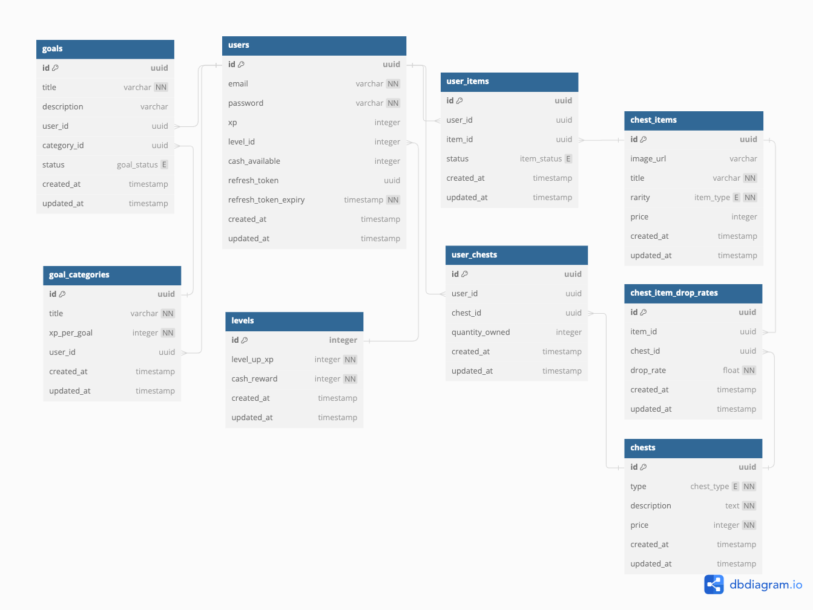

# Gamified Goals Project
## Introduction
- Currently daily and long term goals/tasks managed and ~~strike through~~  on Notion to indicate completion
- Not a very satisfying way to mark tasks and goals as complete
- Idea is to create a web application which gamifies daily goals/tasks and long term goals completion
- XP from goals completed will level users up adding cash to their in game balance
- Cash from their balance can be used to purchase exclusive items and chests which can unlock gear to customize their avatar
- Implements collaborative aspects to tracking goals with friends, joint efforts and shared goals also provide XP
- Avatars can be customized using cash received through level ups and chests, chests drop exclusive items to customize avatars
## Functional Requirements
### User Stories
- As a goal creator I should be able to set up a list of daily tasks/goals and mark them as complete or incomplete so that I can manage my goals
- As a goal creator I should be able to set up long term goals and mark them as complete or incomplete so that I can effectively manage my goals
- As a user I should be able to see my XP and progress towards the next level so that I can track my progress
- As a goal creator I should be able to breakdown long term goals into shorter smaller and more managable goals so that it's easier to complete my goals
- As a goal creator I should be able to tag daily goals with ideas and tasks that complete them (i.e commit once on github can be tagged with ideas for todays commit) so that it's easier to complete my goals
- As a goal creator I should be able to add friends to compare progress with them as well
- As a goal creator I should be able to customize my avatar with items purchased through cash or obtained from chests so that I can demonstrate progress
- As a goal creator I should be able to open chests for chances to receive exclusive items that I can equip for my avatar
- As a goal creator I should be able to buy chests for a cash premium so that I can use my cash to gain exclusive item for my avatar
## Non-functional Requirements
### Performance
- Backend will be written in Go, compiled language extremely performant if code is well written
### Security
- Authentication and authorization of user accounts maintained through jwt based authentication
### Scalability
- Sacrifice scalability through monolithic architecture
- Trade-off made to enhance developer productivity and speed, will be easier to deploy a monolith with a free-tier service like render
### Usability
- Extremely minimal User Interface design to enhance user experience
- Few pages most actions can be done within 1-4 clicks, minimal screen/page switching
## System Architecture
### High Level Overview
There are two potential avenues that can be pursued with respect to the architecture of this project:
- An entire TypeScript Ecosystem leveraging the T3 Stack or something similar, using Next.js, TypeScript, Zod, TRPC, Prisma and React and Tailwind along with relevant database technologies
- A React TypeScript Frontend using Vite or Next.js, along with a Go + Fiber backend dockerized and deployed seperately
## API

| URL                                | Description                                                                                          |
| ---------------------------------- | ---------------------------------------------------------------------------------------------------- |
| GET /api/goals                     | Returns the goals for the user                                                                       |
| POST /api/users                    | Creates a user in the system based on email and password                                             |
| PATCH /api/goals/:goal_id          | Marks a task/goal as complete, grants the user xp for completing the goal                            |
| POST /api/shop/items/:item_id      | If the user has enough funds, buys the item from the shop                                            |
| POST /api/shop/chests/:chest_type  | If the user has enough funds, buys one chest from the shop                                           |
| GET /api/users/                    | Gets all details related to currently logged in user                                                 |
| PATCH /api/items/equip/:item_id    | If the user owns the item identified by item_id, equip that item on their avatar                     |
| POST /api/chests/:chest_type       | If the user has a chest of this type available, open it and return the items received from the chest |
| PATCH /api/goals/complete/:goal_id | Mark goal as complete or not complete depending on current status                                    |
| POST /api/goals                    | Create a goal                                                                                        |

## Data
- Metadata storage of users and their account information (email & password)
- Metadata storage of data for each level, XP required to level up, and cash earned at this level
- Metadata Storage of users level, cash and current XP (progress to next level)
- Metadata Storage of users items that are used to customize their avatar
- Metadata Storage of the currently equipped items on the avatar of each user
- Metadata Storage of chests, types of chests available, percentage of item drops in chests
- Metadata Storage of what chests users currently have
- Object storage of chest images, item images

## Deployment
- Backend docker container deployed to any free hosting service, render, railway
- PostgreSQL deployed to managed database service with free tier, Supabase
- Frontend deployed on Netlify or Vercel
- Object/Blob storage on a free hosting service
